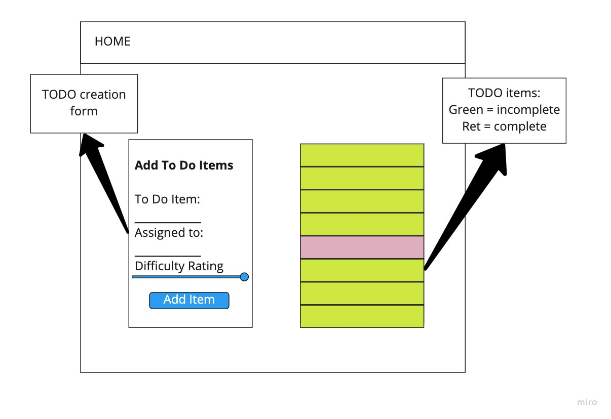

# TODO App
# Author: Lydia Minehan-Tubic

## Links & Resources

✨ [Deployed Site](https://todo-lmt.netlify.app/)

✨ [Pull Request](https://github.com/LydiaMT/todo/pull/3)

## About this Application 

Today, we begin the first of a 4-phase build of the To Do List Manager, a web-based task manager application, written in React. In this first phase, our goal is to setup a foundational system using React hooks that we can build upon in later phases, adding databases, logins, and more advanced features.

## Dependencies

- bootstrap
- react
- react-bootstrap
- react-dom
- react-scripts

# Day 1

## Event Architecture

